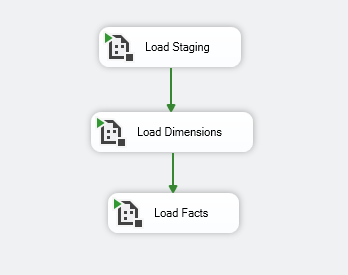
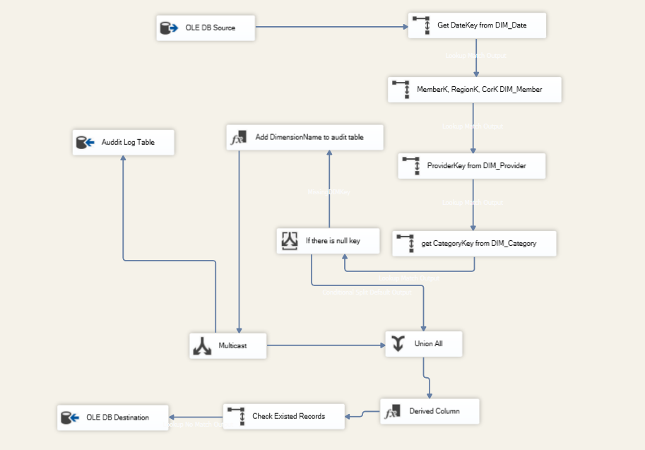
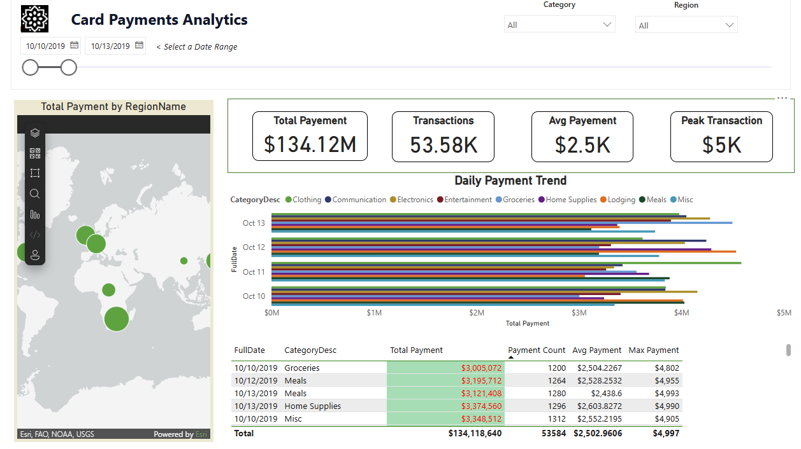
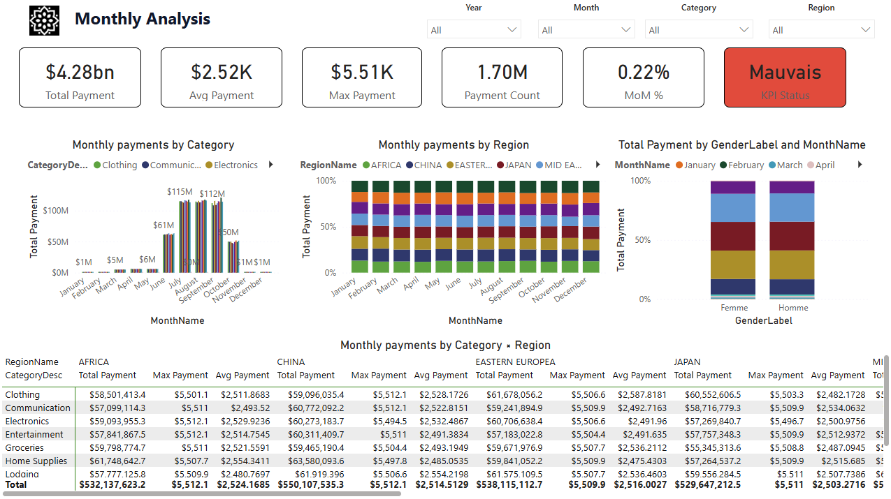
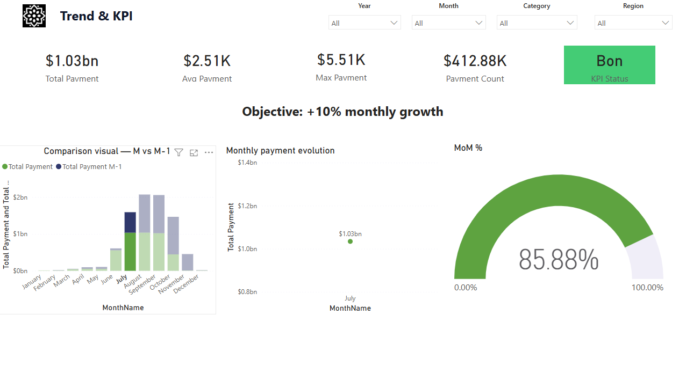

# 💳 Card Payment Tracking (Suivi des paiements par carte)

## 📖 Overview
**Card Payment Tracking** is a comprehensive Business Intelligence solution designed to monitor and analyze card payment data. This project orchestrates the entire data lifecycle, from extraction and transformation to visualization, enabling stakeholders to gain actionable insights into daily transaction trends, monthly performance, and long-term analytics.

The solution leverages **SSIS (SQL Server Integration Services)** for robust ETL processes and **Power BI** for interactive and insightful reporting.

---

## 🏗️ Architecture

The system architecture follows a classic BI layered approach:
1.  **Source System**: Transactional data (files/databases).
2.  **Staging Area**: Intermediate storage for raw data to minimize impact on source systems.
3.  **Data Warehouse (DWH)**: Structured Star Schema (Facts & Dimensions) optimized for reporting.
4.  **Presentation Layer**: Power BI dashboards for end-user consumption.

### 🛠️ Technology Stack
*   **ETL**: Microsoft SSIS (SQL Server Integration Services)
*   **Database**: SQL Server
*   **Reporting**: Microsoft Power BI
*   **IDE**: Visual Studio (SSDT), Power BI Desktop

---

## 🔄 ETL Process (SSIS)

The ETL process is modularized into dedicated packages to ensure maintainability and error handling.

### Master Orchestration
The `MASTER_ETL.dtsx` package orchestrates the execution of child packages, ensuring dependencies are respected and providing a centralized control point for the data load.

### Data Flow Components
1.  **Staging Load (`PKG_01_Load_Staging.dtsx`)**: Ingests raw data from source files/systems into the staging tables.
2.  **Dimension Load (`PKG_02_Load_Dimension_.dtsx`)**: Processes and updates dimension tables (e.g., *DimDate*, *DimCardType*, *DimStore*), handling Slowly Changing Dimensions (SCD) if applicable.
3.  **Fact Load (`PKG_03_Load_Fact_Payment.dtsx`)**: Loads the transactional facts into *FactPayment*, linking them to corresponding dimensions.

**Fact Loading Logic:**
The fact load process ensures data integrity and high performance during the transformation and loading phases.

---

## 📊 Dashboard & Reporting (Power BI)

The specialized Power BI report provides a 360-degree view of payment activities.

### 1. Daily Analysis
Focuses on day-to-day operations, allowing operational managers to track daily volumes, rejection rates, and peak transaction hours.

### 2. Monthly Performance
Provides high-level KPIs and monthly aggregations to track growth and performance against targets.

### 3. Trend Analysis
Visualizes long-term trends to identify seasonality, growth patterns, and anomalies in payment behaviors.

---

## 🚀 Getting Started

### Prerequisites
*   **SQL Server**: Local or server instance with database engine installed.
*   **Visual Studio**: With Data Storage and Processing (SSDT) workload.
*   **Power BI Desktop**: Latest version.

### Installation & Execution
1.  **Database Setup**:
    *   Execute the DDL scripts (not included in repo, ensure DB `Suivi des paiements par carte` exists).
2.  **ETL Configuration**:
    *   Open `Suivi des paiements par carte.sln` in Visual Studio.
    *   Configure the connection managers in the Solution Explorer to point to your local SQL Server instance.
3.  **Run ETL**:
    *   Open `MASTER_ETL.dtsx`.
    *   Click **Start** to run the full load pipeline.
4.  **View Report**:
    *   Open `report.pbix` in Power BI Desktop.
    *   Refresh the data to pull the latest loaded data from your local database.

---

*Generated by [Antigravity]*
